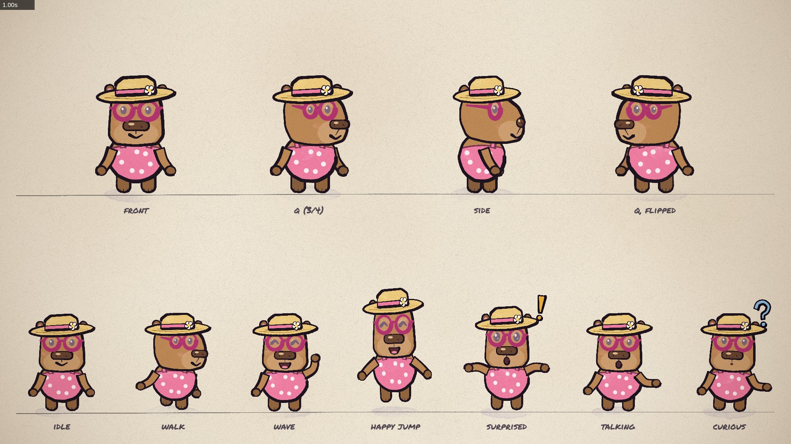

# Cara the Capybara: painted animation

Animated episodes of the children's YouTube series *Cara the Capybara*, painted in code with [p5.js](https://p5js.org)
and [p5.brush](https://github.com/acamposuribe/p5.brush), rendered in headless Chromium and encoded with ffmpeg. It's a
fork of [ClaudeAnimationBase](https://github.com/JohnHeibel/ClaudeAnimationBase) with its character (Clawd) replaced
by Cara, a friendly capybara in pink sunglasses, a straw hat and a pink swimsuit, plus Dewi, a little Welsh dragon.



## Make an episode

Open the repo in Claude Code and ask for what you want, for example:

> Read ANIMATION_GUIDE.md and CARA_STYLE_GUIDE.md, then write a storyboard for a 60-second episode where Cara builds a
> sandcastle with Dewi. Show me the storyboard before building it, and use one subagent per scene file.

The workflow is: storyboard first ([STORYBOARD.md](STORYBOARD.md) is the Wales test's), then build shot by shot,
checking contact sheets, then render. [CARA_STYLE_GUIDE.md](CARA_STYLE_GUIDE.md) holds the house style (palette, brush,
line weight, child-friendly pacing, and how subagents structure scene code). [ANIMATION_GUIDE.md](ANIMATION_GUIDE.md)
holds the general rules, the review loop and the engine reference.

## Run it yourself

You need Node.js, Chromium (or Google Chrome) and ffmpeg. On Arch/Omarchy: `sudo pacman -S chromium ffmpeg`, plus Node
(from `pacman -S nodejs npm`, or mise). Then:

```bash
npm install
npm run video          # out/<name>.mp4           1920×1080, 30 fps (name, length and fps come from src/config.js)
npm run shorts         # out/<name>-vertical.mp4  1080×1920 for YouTube Shorts
```

Open [studio.html](studio.html) in Chromium to scrub through the scene (`?t=12.5` jumps to a time, `?loop=cara` or
`?loop=dragon` shows a model sheet, `&vertical` shows the Shorts framing).

### Render a new scene

1. Write its storyboard, then its scene file in `src/scenes/` (see CARA_STYLE_GUIDE.md §6 for the structure).
2. In [src/config.js](src/config.js), set `name`, `duration` (and `audio`, once you have it).
3. In [studio.html](studio.html), replace the `src/scenes/cara-wales-test.js` script tag with your scene file(s).
4. Check it, then render:

```bash
node render.mjs --sheet=1,4,8,12 --cols=4 --w=480 --out=out/check/sheet.jpg              # contact sheet
node render.mjs --strip=3:4 --out=out/check/strip.jpg                                      # every frame of a moment
node render.mjs --vertical --sheet=1,4,8,12 --cols=4 --w=270 --out=out/check/vertical.jpg  # Shorts framing
npm run video && npm run shorts                                                            # the final MP4s
```

`npm run video` is `node render.mjs --frames --workers=4 --fresh && node render.mjs --encode`: parallel, resumable
JPEG frames in `out/frames/<name>/`, then one encode. Leave out `--fresh` to resume an interrupted render; keep it
after changing the scene, or old frames get reused.

## Audio (voiceover and music)

Episodes render silent until the audio exists. To add ElevenLabs voiceover and music:

1. Put the files in `assets/audio/`.
2. Set `PROJECT.audio` in `src/config.js`, either one file or a list of tracks with a start time and volume:
   ```js
   audio: [{ src: 'assets/audio/ep01-cara.mp3', at: 0.5 }, { src: 'assets/audio/theme.mp3', gain: 0.3 }]
   ```
   The tracks are mixed and padded with silence, so a voiceover shorter than the scene never cuts the video short.
   `--audio=file.mp3` on the command line overrides it for one render.
3. Lip-sync: `node tools/mouth_track.mjs assets/audio/ep01-cara.mp3 --at=0.5` writes `src/audio/ep01-cara.mouth.js`
   (her mouth opening per frame, from the voice's loudness). Add it to studio.html before the scene, and in the scene
   replace the placeholder talking spans (`LINES`) with the track's name: `talk(t, 'ep01-cara')`.

## Linux notes and fixes in this fork

The base kit was written on Windows. What changed so it works on Omarchy (Arch Linux, Intel HD 520 + GTX 950M laptop):

- **Chrome path.** `render.mjs` used to try the Windows and macOS paths first. It now picks candidates by OS; on Linux it
  tries `/usr/bin/chromium` (Arch's `chromium` package), `google-chrome-stable`, `google-chrome`, snap and Playwright
  builds. Override with `--chrome=<path>` or `CHROME_PATH`.
- **GPU.** Headless Chromium's default flags (`--use-gl=angle`) get WebGL on the Intel iGPU
  (`node gpu_probe.mjs /usr/bin/chromium` to check). Frames take about 0.4–2.5 s each.
- **WebGL context loss.** On the Intel iGPU, a frame with hundreds of small painted polygons, or several very large
  `wash` bands, makes p5.brush lose its WebGL context, and frames come out black. The render log shows
  `CONTEXT_LOST_WEBGL`. Fine repeated detail (wall stones, grass) is drawn as `inkLine` strokes instead; see the
  performance rule in CARA_STYLE_GUIDE.md.
- **Frame rate.** The base kit rendered at 24 fps with 12 boils a second. At 30 fps that holds drawings unevenly
  (2, 3, 2, 3 frames), so boil is now 10 a second (every 3 frames), and fps comes from `PROJECT.fps`.
- **Audio.** The base kit muxed one track with `-shortest`, which cut the video down to the length of a shorter
  voiceover. It now mixes any number of tracks and pads them with silence to the video's length.
- **Vertical.** `--vertical` renders a native 1080×1920 version (not a crop): the page's canvas is resized and each
  scene gives a vertical camera path with `fmt(landscape, vertical)`.

## What's here

| path | what it is |
|---|---|
| [CARA_STYLE_GUIDE.md](CARA_STYLE_GUIDE.md) | The house style: palette, brush, pacing for young children, scene structure for subagents |
| [ANIMATION_GUIDE.md](ANIMATION_GUIDE.md) | General rules, workflow and the full engine API |
| [STORYBOARD.md](STORYBOARD.md) | The Wales test scene's storyboard |
| [src/cara.js](src/cara.js) | Cara: views, poses (idle, walk, wave, happy jump, surprised, talking), acted mood changes, lip-sync |
| [src/dragon.js](src/dragon.js) | Dewi the Welsh dragon, and soft smoke puffs |
| [src/emotes.js](src/emotes.js) | Painted reaction marks (!, ?, hearts…) |
| [src/core.js](src/core.js) | Painting, timing, motion helpers, camera, the SOFT palette, formats |
| [src/timeline.js](src/timeline.js) | Shots, loops and the brush-wipe transition |
| [src/config.js](src/config.js) | Episode name, length, fps, tempo and audio |
| [src/scenes/](src/scenes/) | Scene files (the Wales test is `cara-wales-test.js`) |
| [render.mjs](render.mjs) | Headless renderer: contact sheets, strips, crops, stills, frames, MP4, `--vertical` |
| [tools/mouth_track.mjs](tools/mouth_track.mjs) | Voiceover → mouth track for lip-sync |
| [docs/](docs/) | Model sheets: [Cara](docs/cara_poses.jpg), [Dewi](docs/dewi.jpg) |

Licence: MIT (from the base kit).
